# AI Observability
This project demonstrate an AI based observability project using Open-Telemetry and HoneyComb MCP server. 

# Project details
To illustrate the functionality of the open-telemetry and honey-comb MCP server, we consume the open-source project developed by open-telemetry community developers. The demo project consists of microservices written in different programming languages that talk to each other over gRPC and HTTP; and a load generator which uses Locust to fake user traffic.
Please visit the [demo architecture](https://opentelemetry.io/docs/demo/architecture/) from official documentation.

# Project background
In today's tech landscape, outages and performance issues such as slow requests, API errors, and random internal 500 errors can cause major disruptions, often leading to widespread panic on platforms like Twitter. This is especially true for distributed systems, where debugging becomes a daunting and complex task. With the sheer number of dashboards, metrics, and logs that need to be analyzed in a limited time frame, identifying the root cause of a failure can feel overwhelming.

This project aims to address this pain point by building a full observability environment that streamlines the debugging process. Using **Kubernetes**, **OpenTelemetry**, **Honeycomb**, and **Honeycomb MCP Server**, we will set up a solution that not only allows you to monitor your distributed systems effectively but also empowers you to quickly identify issues.

One of the key features of this project is the integration of an **AI assistant** that can help you debug performance issues. By simply asking why a service is slow, the AI will pull relevant telemetry data from Honeycomb and provide insights in real-time, significantly reducing the time it takes to troubleshoot and resolve issues.

This system aims to simplify the process of observing, debugging, and maintaining modern distributed applications, saving time and reducing frustration for engineers and DevOps teams. Let’s dive in!

## What we will build out of this project ?
**This guide walks you through a complete observability workflow:**
- Setup a Azure Kubernetes services (AKS) in Azure
- Deploy the OpenTelemetry Demo App
- Setup a HoneyComb account
- Route all telemetry HoneyComb
- Integrate HoneyComb MCP in  VS Code
- Authenticate using OAuth
- and finally, debug our system using natural language

By the end, you’ll have a full AI-powered observability stack running in AKS Cluster

## Data Flow Overview

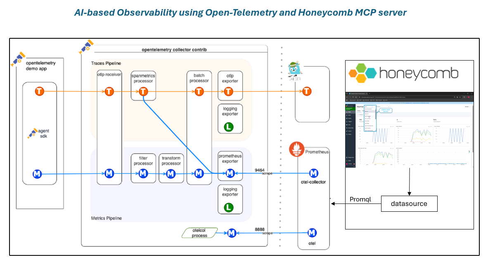

## Technical Guide
### Step 1: Setup a Kubernetes Cluster
To create the kubernetes cluster in Azure, please follow this [readme.md](https://github.com/cloudvignesh/robotshop-microservices?tab=readme-ov-file#create-the-azure-kubernetes-service) which clearly explains the step-by-step instructions on how to setup the cluster.

### Step 2: Create a HoneyComb Account
- Go to: [https://ui.honeycomb.io](https://ui.honeycomb.io/)
- Sign up (Google or email)
- Create an Environment
- Go to Settings and API Keys
- Copy your Team API Key

Dataset name we will use: **otel-demo**

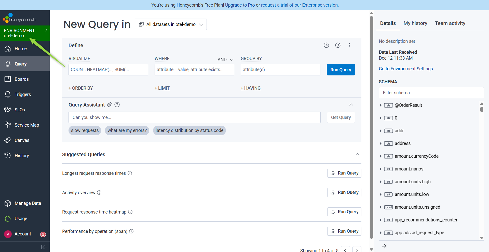

### Step 3: Install OTEL Helm Chart
Add OTEL Helm repo
```bash
helm repo add open-telemetry https://open-telemetry.github.io/opentelemetry-helm-charts
helm repo update
```
Create namespace
```bash
kubectl create namespace otel-demo
```

### Step 4: Create values.yaml
Create a file named values.yaml with:
```yaml
opentelemetry-collector:
  enabled: true

  config:
    receivers:
      otlp:
        protocols:
          http: {}
          grpc: {}

    processors:
      batch: {}

    exporters:
      otlphttp/honeycomb:
        endpoint: https://api.honeycomb.io
        headers:
          x-honeycomb-team: "<YOUR_API_KEY>"
          x-honeycomb-dataset: "otel-demo"

    service:
      pipelines:
        traces:
          receivers: [otlp]
          processors: [batch]
          exporters: [otlphttp/honeycomb]

        metrics:
          receivers: [otlp]
          processors: [batch]
          exporters: [otlphttp/honeycomb]

        logs:
          receivers: [otlp]
          processors: [batch]
          exporters: [otlphttp/honeycomb]
```
Replace <YOUR_API_KEY> with your Honeycomb key.

### Step 5: Deploy OTEL demo app with helm
Install demo + collector
```bash
helm upgrade --install otel-demo open-telemetry/opentelemetry-demo \
  -n otel-demo -f values.yaml
```
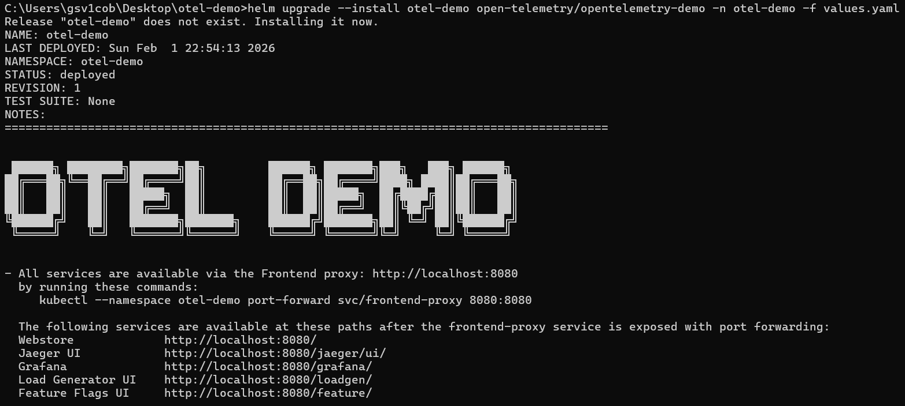
Verify pods
```bash
kubectl get pods -n otel-demo
```
Look for the below pods are running:
- frontend
- cartservice
- loadgenerator
- otel-collector

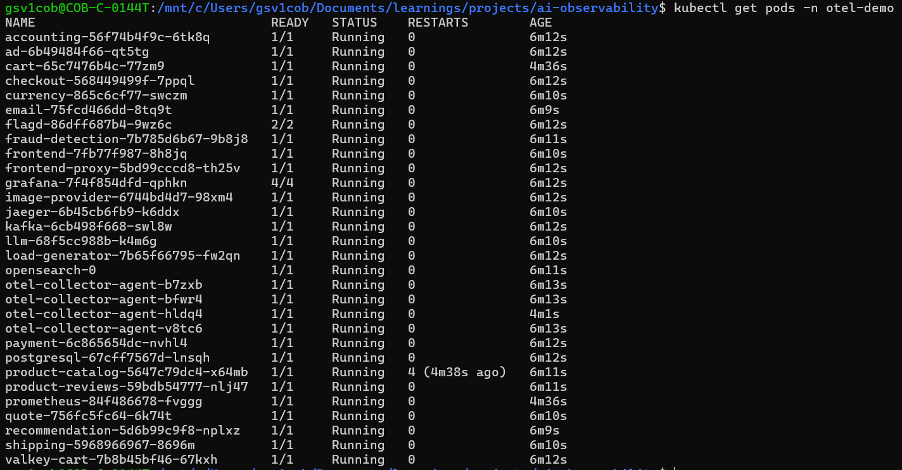

### Step 6: Setup Gateway resource for Gateway-API
**Note:** Make sure all the necessary resources created like cluster setup, load balancer setup, configuring ALB controller as mentioned in the [readme.md](https://github.com/cloudvignesh/robotshop-microservices?tab=readme-ov-file#create-the-azure-kubernetes-service). 
Once all the setup done, follow the below instruction to create the gateway resource
```bash
RESOURCE_GROUP='<resource group name of the Application Gateway For Containers resource>'
RESOURCE_NAME='alb-web-app-test'

RESOURCE_ID=$(az network alb show --resource-group $RESOURCE_GROUP --name $RESOURCE_NAME --query id -o tsv)
FRONTEND_NAME='otel-demo'

kubectl apply -f - <<EOF
apiVersion: gateway.networking.k8s.io/v1
kind: Gateway
metadata:
  name: gateway-03
  namespace: otel-demo
  annotations:
    alb.networking.azure.io/alb-id: $RESOURCE_ID
spec:
  gatewayClassName: azure-alb-external
  listeners:
  - name: http
    port: 80
    protocol: HTTP
    allowedRoutes:
      namespaces:
        from: Same
  addresses:
  - type: alb.networking.azure.io/alb-frontend
    value: otel-demo
EOF
```
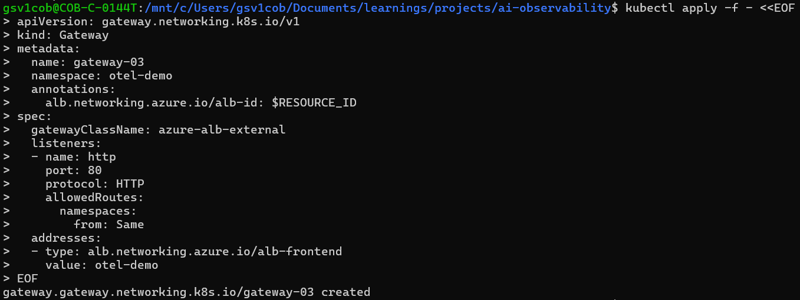

### Step 7: Setup the HTTProute resource
Configure the HTTProute resource to route the traffic to inbound endpoint of the load balancer
```bash
kubectl apply -f - <<EOF
apiVersion: gateway.networking.k8s.io/v1
kind: HTTPRoute
metadata:
  name: otel-demo-route
  namespace: otel-demo
spec:
  parentRefs:
  - name: gateway-03
  rules:
  - backendRefs:
    - name: frontend-proxy
      port: 8080
      weight: 1
EOF
```
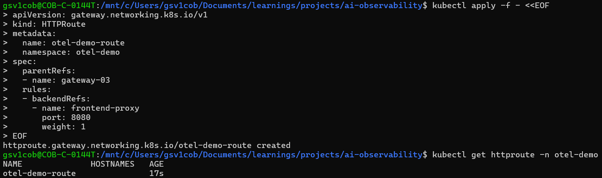

### Step 8: Explore the application
Open browser and paste your load balancer endpoint to access the open-telemetry demo storefront UI

**Action:** Explore the app: Go to shopping -> Add Products in the cart -> Place Order. So that the metrics, traces will appear in the honeycomb dashboard.


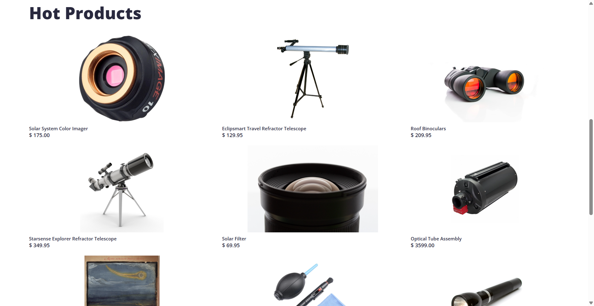

### Step 9: Check the Honeycomb Dashboard
- Open Honeycomb.io
- Select dataset: **otel-demo**
- **Verify:**
    - traces arriving
    - span waterfalls
    - latency graphs
    - service map
    - error rates

Your collector is exporting correctly if you see fresh traces.

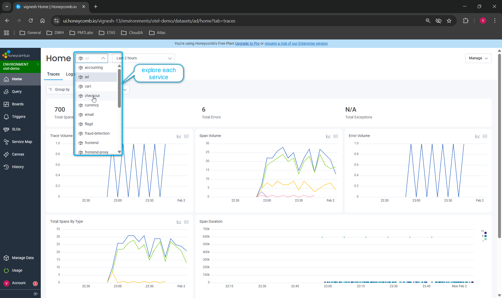

### Step 9: Setup HoneyComb MCP in VS Code
1. Open VS Code Settings
Search: Model Context Protocol

2. Add Honeycomb MCP server config
Add in your VS Code’s MCP servers:
```json
{
  "servers": {
    "honeycomb": {
      "url": "https://mcp.honeycomb.io/mcp",
      "type": "http"
    }
  },
  "inputs": []
}
```
3. Restart the VS Code
4. OAuth Login
VS Code will pop up a browser:
- Log into Honeycomb
- Click **Allow**

Now VS Code Copilot Chat can query your Honeycomb data directly.

### Step 10: Natural-language MCP Questions:
Use these in Copilot Chat inside VS Code:
#### Performance
1. Show me the slowest endpoint in the last 20 minutes.
2. List the top 5 slowest services.
3. Which endpoints have p95 latency > 500ms?
4. What caused the latency spike in the last hour?
5. Show me traces where checkout took more than 500ms.

#### Errors
1. List endpoints with the highest error rate.
2. Which service produced the most errors today?
3. Show me the recent 100 errors grouped by service.

#### Traffic
1. Which service handled the most requests in the last hour?
2. Show me the busiest endpoints right now.
3. What are the top 10 endpoints by request volume?

#### Debugging
1. Explain the cause of the latest latency spike.
2. Summarize anomalies in the last 30 minutes.
3. Why is checkout slow today?
4. Show me traces where frontend took more than 1 second.

**Refer the below screenhots on how MCP services and Copilot** will help to troubleshoot or debugging the application metrics, traces and logs.

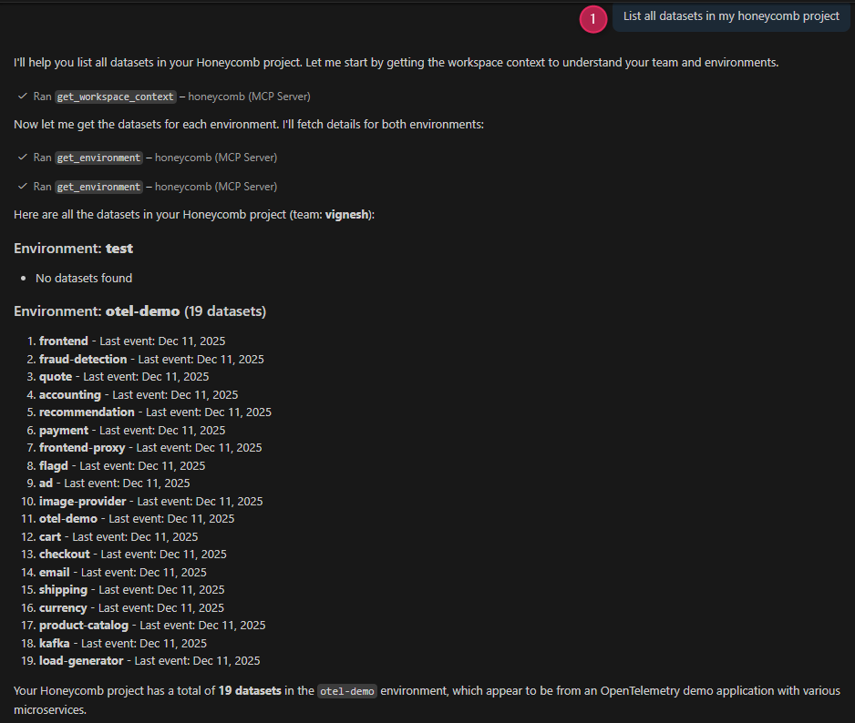
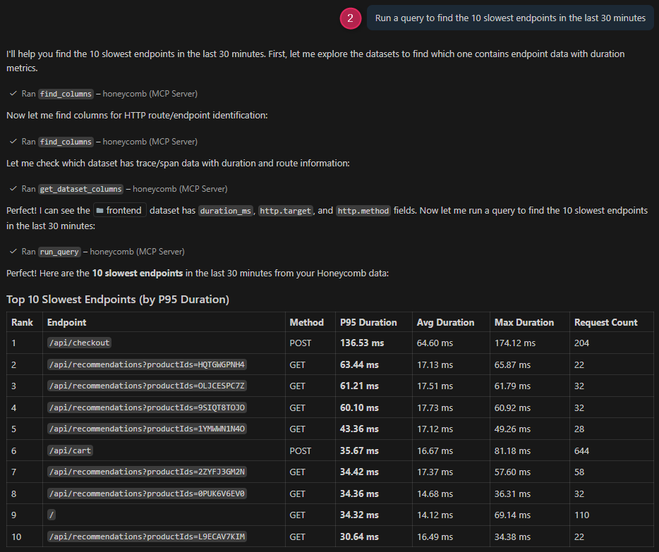
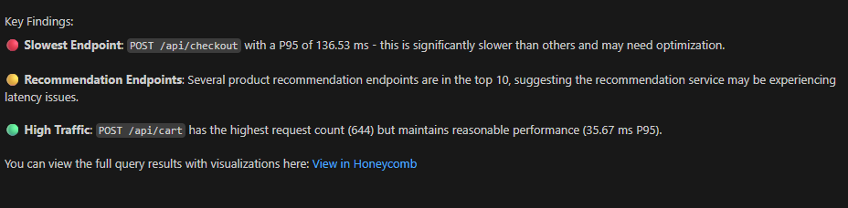
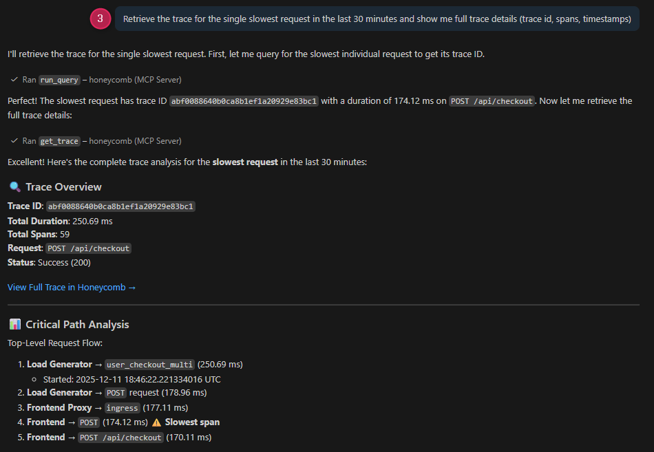
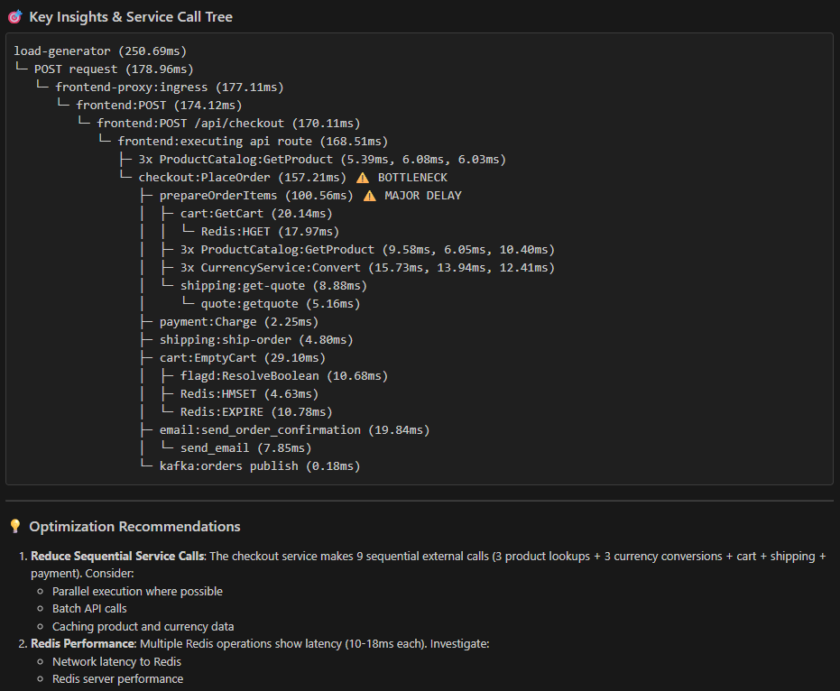

### Additonal services from Open-Telemtry demo application
Access other services for tracking, monitoring and load generation once exposed via port-forwarding or load-balancer.
- Jaeger UI           http://localhost:8080/jaeger/ui/
- Grafana             http://localhost:8080/grafana/
- Load Generator UI   http://localhost:8080/loadgen/
- Feature Flags UI    http://localhost:8080/feature/
---

**Built with ❤️ by [cloudvignesh](https://github.com/cloudvignesh)**